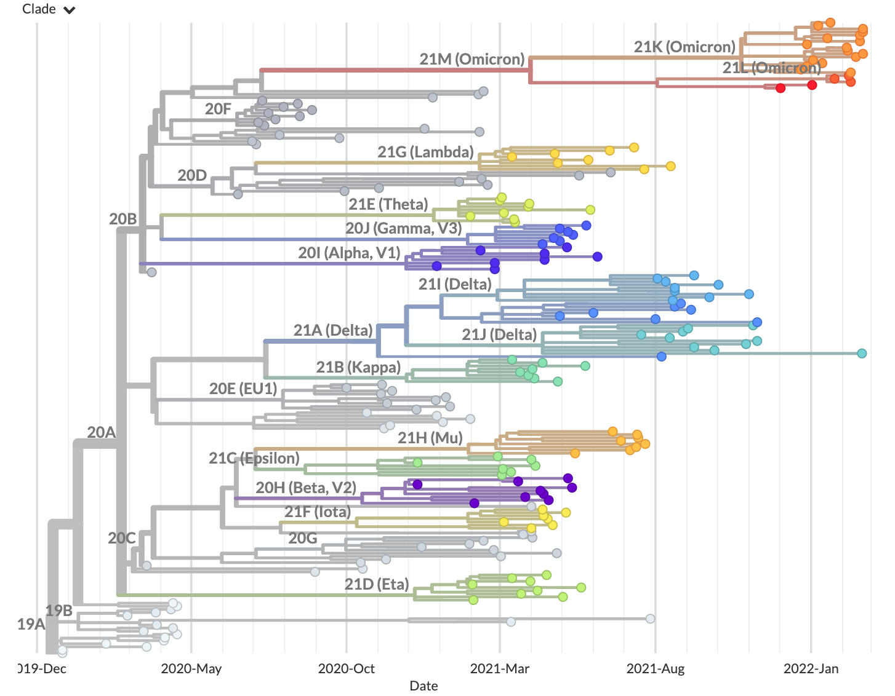

Create a build with custom data
===============================

In this tutorial section, you will add custom focal data to the build with the example reference data. The reference data will serve as background context for the new data.

.. contents:: Table of Contents
   :local:

Prerequisites
-------------

1. :doc:`example-data`. These instructions will set up the command line environment used in this section.

Setup
-----

If you are not already there, change directory to the ``ncov`` directory:

   .. code:: text

      cd ncov

Curate data from GISAID
-----------------------

.. warning::

   This section requires a GISAID account. `Register <https://www.gisaid.org/registration/register/>`__ if you do not have an account yet. However, registration may take a few days. Follow `alternative data preparation methods <../guides/data-prep.html>`__ if you wish to continue this tutorial in the meantime.

We will retrieve 10 sequences from GISAID's EpiCoV database.

1. Navigate to `GISAID <https://www.gisaid.org/>`__ and select **Login**.

   .. image:: ../images/gisaid-homepage.png
      :width: 400
      :alt: GISAID login link

2. Login to your GISAID account.

   .. image:: ../images/gisaid-login.png
      :width: 200
      :alt: GISAID login

3. In the top left navigation bar, select **EpiCoV** then **Search**.

   .. image:: ../images/gisaid-epicov-search.png
      :width: 400
      :alt: GISAID EpiCoV Search

4. Select the first 10 records.

   .. note::

      You can filter and select a different set of records here, but note that more records will take the workflow longer to run, and the GISAID web interface has a maximum of 5,000 records per download.

   .. image:: ../images/gisaid-select-records.png
      :width: 700
      :alt: GISAID EpiCoV Search

5. Select **Download** in the bottom right of the search results.
6. Select **Input for the Augur pipeline** as the download format.
7. Select **Download**.

   .. image:: ../images/gisaid-augur-pipeline-download.png
      :width: 400
      :alt: GISAID EpiCoV Search

   .. note::

      You may see different download options, but it is fine as long as **Input for the Augur pipeline** is available.

8. Extract by opening the downloaded ``.tar`` file in your file explorer. It contains two files: one ending with ``.metadata.tsv`` and another with ``.sequences.fasta``.
9.  Move these extracted files to the ``data/`` directory in the ``ncov/`` directory.
10. Rename the files as ``custom.metadata.tsv`` and ``custom.sequences.fasta``.

Run the workflow
----------------

From within the ``ncov/`` directory, run the ``ncov`` workflow using a pre-written ``--configfile``:

.. code:: text

   nextstrain build . --cores 4 --configfile ncov-tutorial/build-with-custom-data.yaml

Break down the command
~~~~~~~~~~~~~~~~~~~~~~

The workflow can take several minutes to run. While it is running, you can investigate the contents of ``build-with-custom-data.yaml``:

.. code-block:: yaml

   inputs:
     - name: reference-data
       metadata: https://data.nextstrain.org/files/ncov/open/reference/metadata.tsv.xz
       sequences: https://data.nextstrain.org/files/ncov/open/reference/sequences.fasta.xz
     - name: custom-data
       metadata: data/custom.metadata.tsv
       sequences: data/custom.sequences.fasta

   # GenBank data includes "Wuhan-Hu-1/2019" which we use as the root for this build.
   refine:
     root: "Wuhan-Hu-1/2019"

   default_build_name: reference-with-custom-data

This is the same as the previous file, with two additions:

1. A second input for the custom data, referencing the metadata and sequences files downloaded from GISAID.
2. A custom build name, ``reference-with-custom-data``.

Visualize the results
---------------------

Run this command to view the results in :term:`docs.nextstrain.org:Auspice`:

.. code:: text

   nextstrain view auspice/

Navigate to ``http://127.0.0.1:4000/ncov/reference-with-custom-data``. The resulting :term:`docs.nextstrain.org:dataset` should have similar phylogeny to the previous dataset, with additional sequences:

