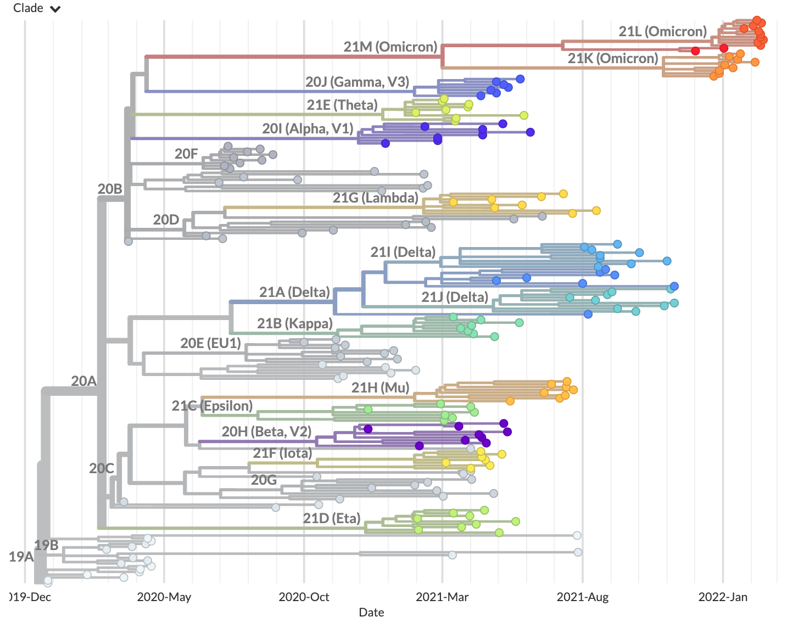

Create a build with example data
================================

In this tutorial section, you will create and run a build from example reference data.

.. contents:: Table of Contents
   :local:

Prerequisites
-------------

1. :doc:`setup`. These instructions will install all of the software you need to complete this tutorial and others.

Setup
-----

1. Activate the ``nextstrain`` conda environment:

   .. code:: text

      conda activate nextstrain

2. Change directory to the ``ncov`` directory:

   .. code:: text

      cd ncov

3. Download the example tutorial repository into a new directory ``ncov-tutorial/``:

   .. code:: text

      $ git clone https://github.com/nextstrain/ncov-tutorial
      Cloning into 'ncov-tutorial'...
      [...more output...]

Run the workflow
----------------

From within the ``ncov/`` directory, run the ``ncov`` workflow using a configuration file provided in the tutorial directory:

.. code:: text

   nextstrain build . --cores 4 --configfile ncov-tutorial/build-with-reference-data.yaml

Break down the command
~~~~~~~~~~~~~~~~~~~~~~

The workflow can take several minutes to run. While it is running, you can learn about the parts of this command:

- ``nextstrain build .``
   - This tells the :term:`docs.nextstrain.org:Nextstrain CLI` to :term:`build <docs.nextstrain.org:build (verb)>` the workflow from ``.``, the current directory. All subsequent command-line parameters are passed to the workflow manager, Snakemake.
- ``--cores 4``
   - This required Snakemake parameter specifies the number of CPU cores to use (`more info <https://snakemake.readthedocs.io/en/stable/executing/cli.html>`_).
- ``--configfile ncov-tutorial/build-with-reference-data.yaml``
   - ``--configfile`` is another Snakemake parameter used to configure the ncov workflow.
   - ``ncov-tutorial/build-with-reference-data.yaml`` is a YAML file with contents:

      .. code-block:: yaml

         inputs:
           - name: reference-data
             metadata: https://data.nextstrain.org/files/ncov/open/reference/metadata.tsv.xz
             sequences: https://data.nextstrain.org/files/ncov/open/reference/sequences.fasta.xz

         # GenBank data includes "Wuhan-Hu-1/2019" which we use as the root for this build.
         refine:
           root: "Wuhan-Hu-1/2019"

      This provides the workflow with one input named ``reference-data``. The metadata and sequences files are downloaded directly from the associated URLs.

      The ``refine`` entry specifies the root sequence for the example GenBank data.

Visualize the results
---------------------

Run this command to view the results in :term:`docs.nextstrain.org:Auspice`:

.. code:: text

   nextstrain view auspice/

Navigate to ``http://127.0.0.1:4000/ncov/default-build``. The resulting :term:`docs.nextstrain.org:dataset` should show a phylogeny of ~200 sequences:

.. note::

   You can also view the results by dragging the file ``auspice/ncov_default-build.json`` onto `auspice.us <https://auspice.us>`__.
